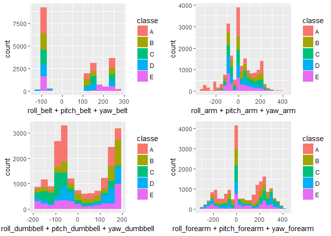
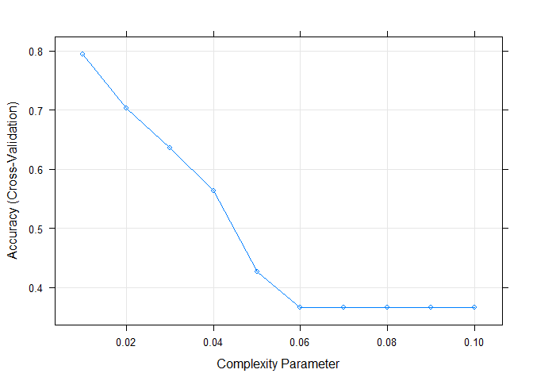
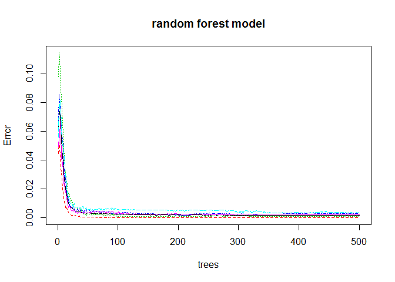

# Predict Manners of Movements in Activities
Wenting Rohwer  
July 11, 2017  


## Overview

The goal of your project is to predict the manner in which they did the exercise. This is the "classe" variable in the training set.

## Load the Data

```r
set.seed(1238)
library(data.table)
library(ggplot2)
library(caret)
```

```
## Loading required package: lattice
```

```r
library(rpart)
library(gridExtra)
library(gbm)
```

```
## Loading required package: survival
```

```
## 
## Attaching package: 'survival'
```

```
## The following object is masked from 'package:caret':
## 
##     cluster
```

```
## Loading required package: splines
```

```
## Loading required package: parallel
```

```
## Loaded gbm 2.1.3
```

```r
library(randomForest)
```

```
## randomForest 4.6-12
```

```
## Type rfNews() to see new features/changes/bug fixes.
```

```
## 
## Attaching package: 'randomForest'
```

```
## The following object is masked from 'package:gridExtra':
## 
##     combine
```

```
## The following object is masked from 'package:ggplot2':
## 
##     margin
```

```r
training <- fread('src/pml-training.csv',na.strings=c("","NA"))
testing <- fread('src/pml-testing.csv')
```
## Data Processing

### 1. Missing data

```r
dim(training)
```

```
## [1] 19622   160
```

```r
missing_percent <- colSums(sapply(training, is.na)) / dim(training)[1]
```
We've noticed there are **100** columns has **97.93%** missing data. This counts for **61.2%** of the total data. All the **100** columns are missing the exact same rows of data.


```r
# percentage of missing data by colums
head(sort(missing_percent,decreasing = T), 3)
```

```
##  kurtosis_roll_belt kurtosis_picth_belt   kurtosis_yaw_belt 
##           0.9793089           0.9793089           0.9793089
```

```r
# percentage of missing data in total
sum(missing_percent)/dim(training)[2]
```

```
## [1] 0.6120681
```

```r
# count of columns have the missing data
table(melt(missing_percent))
```

```
## 
##                 0 0.979308938946081 
##                60               100
```

**We will toss these bad various as they will likely to confuse our model. Later, we could try to reintegrate them, maybe with imputed values.**


```r
bad_cols <- melt(which(missing_percent>0.9))$value
training_na <- training[,bad_cols, with=F]
tmp <- training[,-bad_cols, with=F]
# verify we have tossed all the bad rows
sum(is.na(tmp))
```

```
## [1] 0
```

```r
training <- tmp
```

```r
dim(training)
```

```
## [1] 19622    60
```
We now have 406 rows and 160 columns. 

### 2.Modify data types


```r
cleandata <- function(df){
  df$user_name <- as.factor(df$user_name)
  cvt <- strptime(df$cvtd_timestamp, "%d/%m/%Y %H:%M")
  df$year <- year(cvt)
  df$month <- month(cvt)
  df$weekday <- as.factor(weekdays(cvt))
  df$hour <- hour(cvt)
  df$minute <- minute(cvt)
  df$new_window <- ifelse(df$new_window == 'yes', 1, 0)
  df$classe <- as.factor(df$classe)
  ## remove redundant features
  df <- subset(df, select=-c(V1,raw_timestamp_part_1, raw_timestamp_part_2, cvtd_timestamp,year))
  df
}
training <- cleandata(training)
```

From looking at the variable names, we could see the variable names are categorized into four body regions: belt, arm, dumbbell, forearm.

Let's plot 'classe' vs sampled variables contain 'belt','arm','dumbbell','forearm'.


```r
#yaw_belt
p1 <- ggplot(data= training, aes(x =roll_belt + pitch_belt + yaw_belt, fill=classe))+geom_histogram(binwidth = 30)

#yaw_arm

p2 <- ggplot(data= training, aes(x =roll_arm + pitch_arm + yaw_arm, fill=classe))+geom_histogram(binwidth = 30)

#yaw_dumbbell
p3 <- ggplot(data= training, aes(x =roll_dumbbell + pitch_dumbbell + yaw_dumbbell, fill=classe))+geom_histogram(binwidth = 30)

#yaw_forearm
p4 <- ggplot(data= training, aes(x =roll_forearm + pitch_forearm +yaw_forearm, fill=classe)) + geom_histogram(binwidth = 30)

grid.arrange(p1,p2,p3,p4, ncol = 2)
```

<!-- -->

## Training Model 
We will partition our training data set to a 70% training set and a 30% data set for cross-validation

```r
intrain <- createDataPartition(y = training$classe, p =0.7,list = F)
tr <- training[intrain,]
cv <- training[-intrain,]
```

### Model 1. Gradient Boosting Machine.

This is a multi-classification problem, so we will use Gradient Boosting Machine method.

```r
mdfit_gbm <- gbm(classe ~., data= tr)
```

```
## Distribution not specified, assuming multinomial ...
```

```r
pre_gbm <- predict(mdfit_gbm,newdata = cv,n.tree = 100, type='response')
result_gbm <- data.table(matrix(pre_gbm,5885,5))
names(result_gbm) <- c('A','B','C','D','E')

result_gbm$predict <- colnames(result_gbm)[max.col(result_gbm,ties.method="first")]
confusionMatrix(result_gbm$predict,cv$classe)
```

```
## Confusion Matrix and Statistics
## 
##           Reference
## Prediction    A    B    C    D    E
##          A 1136  435  225  274  267
##          B    3  297   25   21   94
##          C  336  296  618  170  142
##          D  173  111  158  499   73
##          E   26    0    0    0  506
## 
## Overall Statistics
##                                           
##                Accuracy : 0.5193          
##                  95% CI : (0.5064, 0.5321)
##     No Information Rate : 0.2845          
##     P-Value [Acc > NIR] : < 2.2e-16       
##                                           
##                   Kappa : 0.3848          
##  Mcnemar's Test P-Value : < 2.2e-16       
## 
## Statistics by Class:
## 
##                      Class: A Class: B Class: C Class: D Class: E
## Sensitivity            0.6786  0.26076   0.6023  0.51763  0.46765
## Specificity            0.7148  0.96987   0.8057  0.89535  0.99459
## Pos Pred Value         0.4861  0.67500   0.3956  0.49211  0.95113
## Neg Pred Value         0.8484  0.84536   0.9056  0.90454  0.89240
## Prevalence             0.2845  0.19354   0.1743  0.16381  0.18386
## Detection Rate         0.1930  0.05047   0.1050  0.08479  0.08598
## Detection Prevalence   0.3971  0.07477   0.2654  0.17230  0.09040
## Balanced Accuracy      0.6967  0.61531   0.7040  0.70649  0.73112
```

The accuracy is 52%, slightly better than a fair coin toss.

### Model 2. Regression Tree


```r
grid <-  expand.grid(cp=c(1:10)*0.01)
mdfit_rpart <- train(classe ~ ., data=tr,method="rpart",tuneGrid=grid,trControl=trainControl(method="cv", number=10))
```

```r
plot(mdfit_rpart)
```

<!-- -->

#### Cross-Validation


```r
pre_rpart <- predict(mdfit_rpart, cv, n.tree = 100)
confusionMatrix(pre_rpart,cv$classe)
```

```
## Confusion Matrix and Statistics
## 
##           Reference
## Prediction    A    B    C    D    E
##          A 1445  191   17   64   46
##          B   43  640   35   30   11
##          C   24  116  855   43   50
##          D  152  191  119  767  197
##          E   10    1    0   60  778
## 
## Overall Statistics
##                                          
##                Accuracy : 0.7621         
##                  95% CI : (0.751, 0.7729)
##     No Information Rate : 0.2845         
##     P-Value [Acc > NIR] : < 2.2e-16      
##                                          
##                   Kappa : 0.6994         
##  Mcnemar's Test P-Value : < 2.2e-16      
## 
## Statistics by Class:
## 
##                      Class: A Class: B Class: C Class: D Class: E
## Sensitivity            0.8632   0.5619   0.8333   0.7956   0.7190
## Specificity            0.9245   0.9749   0.9520   0.8661   0.9852
## Pos Pred Value         0.8196   0.8432   0.7858   0.5379   0.9164
## Neg Pred Value         0.9444   0.9027   0.9644   0.9558   0.9396
## Prevalence             0.2845   0.1935   0.1743   0.1638   0.1839
## Detection Rate         0.2455   0.1088   0.1453   0.1303   0.1322
## Detection Prevalence   0.2996   0.1290   0.1849   0.2423   0.1443
## Balanced Accuracy      0.8938   0.7684   0.8927   0.8309   0.8521
```


The accuracy is 73.67%, a big improvement from gbm but I think we might be able to do better.

### Model 3. Random Forest


```r
mdfit_rf <- randomForest(classe ~. , data=tr, method="class")
pred_rf<- predict(mdfit_rf, cv, type = "class")
```

```r
plot(mdfit_rf,main= 'random forest model')
```

<!-- -->

#### Cross-Validation


```r
confusionMatrix(pred_rf, cv$classe)
```

```
## Confusion Matrix and Statistics
## 
##           Reference
## Prediction    A    B    C    D    E
##          A 1673    3    0    0    0
##          B    1 1136    4    0    0
##          C    0    0 1022    5    0
##          D    0    0    0  958    0
##          E    0    0    0    1 1082
## 
## Overall Statistics
##                                          
##                Accuracy : 0.9976         
##                  95% CI : (0.996, 0.9987)
##     No Information Rate : 0.2845         
##     P-Value [Acc > NIR] : < 2.2e-16      
##                                          
##                   Kappa : 0.997          
##  Mcnemar's Test P-Value : NA             
## 
## Statistics by Class:
## 
##                      Class: A Class: B Class: C Class: D Class: E
## Sensitivity            0.9994   0.9974   0.9961   0.9938   1.0000
## Specificity            0.9993   0.9989   0.9990   1.0000   0.9998
## Pos Pred Value         0.9982   0.9956   0.9951   1.0000   0.9991
## Neg Pred Value         0.9998   0.9994   0.9992   0.9988   1.0000
## Prevalence             0.2845   0.1935   0.1743   0.1638   0.1839
## Detection Rate         0.2843   0.1930   0.1737   0.1628   0.1839
## Detection Prevalence   0.2848   0.1939   0.1745   0.1628   0.1840
## Balanced Accuracy      0.9993   0.9982   0.9975   0.9969   0.9999
```

We have a **99.75%** accuracy on random forest algorithm. The best so far.

### Decision

We will choose random forest model for our final evaluation of the test data. The expected out-of-sample error is 1 - accuracy for predictions on cv set. The expected OOS error is 0.25%. Given we have 20 examples in the test set, we expect we will get very few if not none misclassification.


## Submission
Random forest model is clearly the winner. So let's use it as our final model.


```r
testing <- cleandata(testing)
testing$classe <- predict(mdfit_rf,testing)
```

Our final prediction for the testing data is 


```r
testing$classe
```

```
##  [1] B A B A A E D B A A B C B A E E A B B B
## Levels: A B C D E
```
